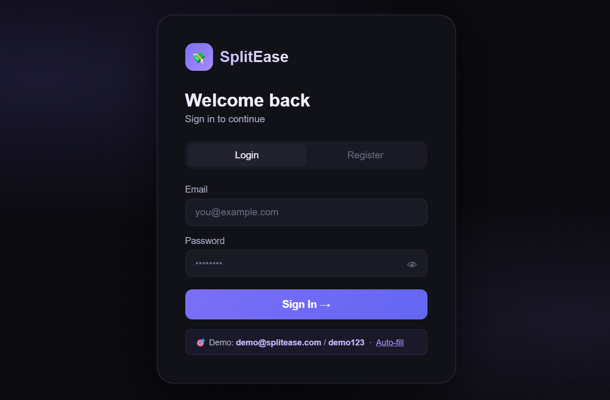
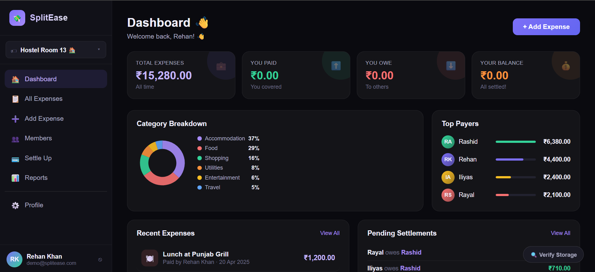
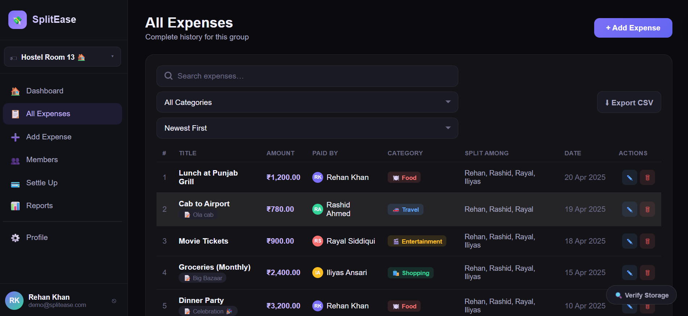
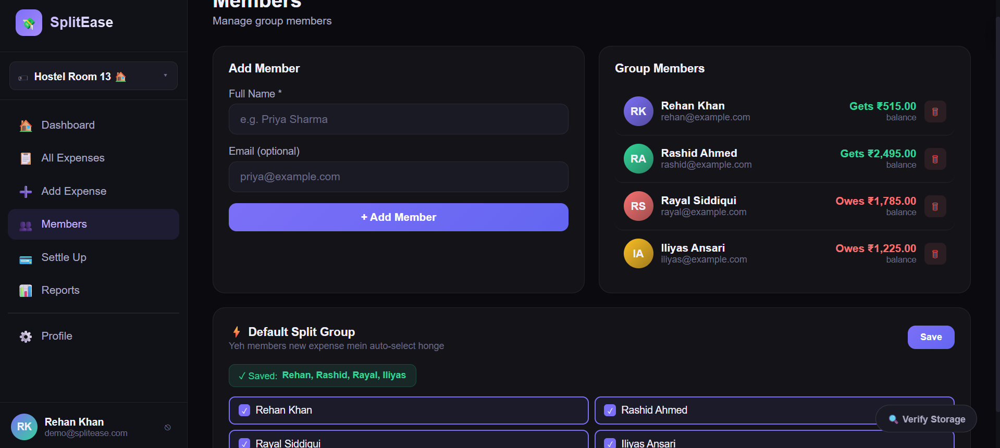
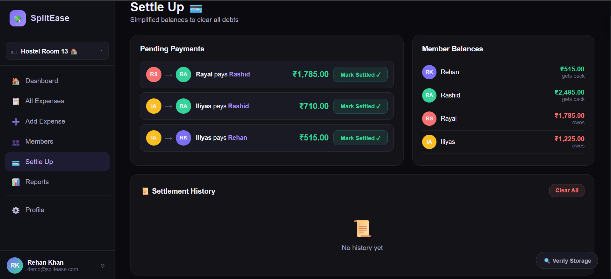

# SplitEase — Smart Expense Splitter

A multi-group expense splitting web app built with vanilla HTML, CSS, and JavaScript. Designed to make splitting bills and tracking shared expenses simple and fast — built as my final year BCA project.

## Features
- Multi-group expense tracking
- Greedy settlement algorithm to minimize number of transactions
- Multi-currency support
- Multi-language UI (including RTL support for Urdu)
- Clean, Gen-Z inspired responsive design
- LocalStorage persistence (works offline, no backend needed)

## Tech Stack
- HTML5
- CSS3
- JavaScript (Vanilla)

## Live Demo
[Try SplitEase Live](https://rehankhan307.github.io/Splitease/)

## Screenshots

## Author
*Rehan Khan*  
[LinkedIn](https://www.linkedin.com/in/rehan-khan-865583319)
